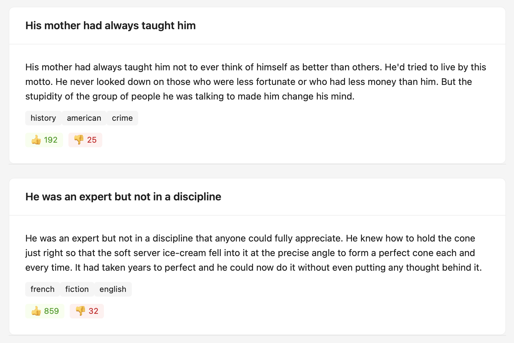

[](https://github.com/professor-severus-snape/task_news_media_holding/actions/workflows/web.yml)

# Задание для компании «News Media Holding»

Приложение для отображения новостной ленты с бесконечной подгрузкой данных.

Новости загружаются с удалённого API и отображаются порциями по 10 карточек при прокрутке страницы.



## Демо

Посмотреть демо можно [здесь](https://professor-severus-snape.github.io/task_news_media_holding/).

## Возможности

- загрузка новостей с удалённого сервера
- бесконечный скролл через Intersection Observer API
- отображение заголовка, текста (не более трёх строк), тегов и количества реакций
- автоматическая подгрузка новых данных при прокрутке
- индикация загрузки данных

## Технологии

- React
- глобальный стейт менеджер — Redux Toolkit
- UI-библиотека — Ant Design
- работа с API — Fetch API
- бесконечный скролл — Intersection Observer API
- типизация — TypeScript
- линтинг — ESLint
- сборка — Vite

## API

Для получения данных используется:

```bash
https://dummyjson.com/posts?limit=10&skip=0
```

## CI/CD

- GitHub Actions — линтинг и сборка проекта (CI)
- GitHub Pages — автоматический деплой приложения (CD)
